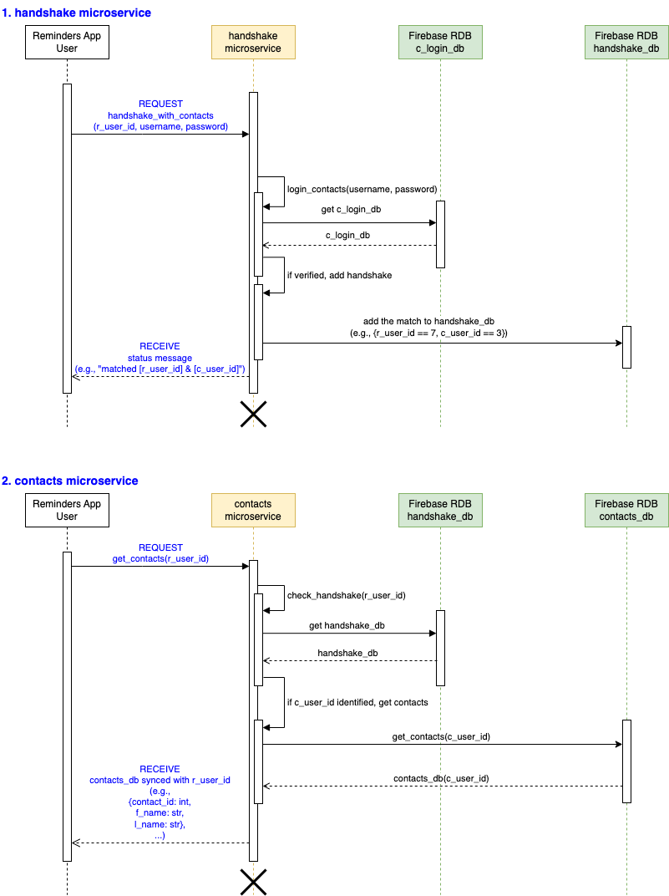

# contactMgmtPy
Manage your professional network efficiently in one place. \
You can view, create, update, and delete your contacts. \
With our login feature, your contact list is kept private.

## Login options
User can choose one of the following login options [0-5]: \
[0] exit the program \
[1] login with username and password (account needed)\
[2] create login profile \
[3] change username and password (login required)\
[4] delete login profile (login required)\
[5] contact developer for any questions or feedback

### [0] exit the program
Program terminates.

### [1] login with username and password (account needed)
User must have an account before logging in. \
If user doesn't have an account, user can create one through `login option [2]`. \
User have five attempts to successfully login. \

After the fifth failed attempt, user is redirected to the `login options`. \
After a successful login, user is redirected to the `contacts list`.

### [2] create login profile
User can create an account with 'valid' username and password.
- 'valid' means that both username and password meet all the validation criteria:
  - username must be unique and less than 24 characters.
  - password must be between 8-12 characters.
  - password must have at least one special character: !@#$%^&*()-_+=
  - password must have at least one number.
  - password must have at least one uppercase.

### [3] change username and password (login required)
User can change username and password. \
User must first verify the correct username and password before the change. \
User must follow the same validation criteria listed in `login option [2]`.

### [4] delete login profile (login required)
User can delete their login profile. \
User must first verify the correct username and password before the deletion. \
**Once user deletes, all associated contacts will be erased permanently.**

### [5] contact developer for any questions or feedback
User can reach out to the developer via email for any questions or feedback. 

## Contacts actions
**Pre-requisite**: user logged in through `login option [1]`. \
User can choose one of the following actions to manage their contacts [0-4]: \
[0] log out \
[1] create a contact \
[2] view a contact detail \
[3] update a contact \
[4] delete a contact

### [0] log out
log out of the user account and get redirected to the login options page.

### [1] create a contact
Pre-requisite: user must have populated a self-contact profile to create other contacts.

The following attributes can be filled in to create a contact:
- `f_name`: first name (required)
- `l_name`: last name (required)
- `m_name`: middle name
- `phone`: personal phone number, mobile or home (e.g., (123)-456-7890)
- `email`: personal email address (e.g., email_id@gmail.com)
- `address`: home address
- `homepage`: URL link (e.g., homepage_url@abcd.com)
- `company`: current workplace (e.g., Google)
- `department`: current team (e.g., sales)
- `title`: current title (e.g., senior director)
- `work phone`: work phone number (e.g., (123)-456-7890
- `work address`: work address
- `memo`: additional details to remember

### [2] view a contact detail
User can select a contact to read the details by providing a valid `contact_id` from the contacts list.

### [3] update a contact
User can select a contact to update one or more of its attributes by providing a valid `contact_id` from the contacts list.

### [4] delete a contact
User can select a contact to delete it from the contacts list by providing a valid `contact_id`.

## Sequence diagram for two microservices

